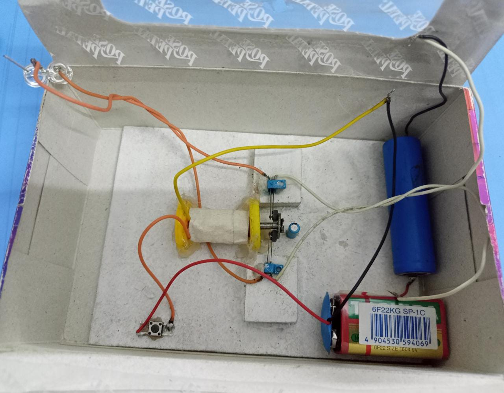
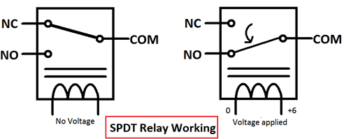
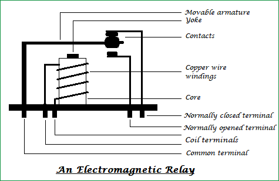

# 🔌 Electromechanical Relay — Applied Physics Project

> An educational laboratory physics project demonstrating the design, construction, and working principles of an electromechanical relay switch to control high-power output circuits using low-power control signals.

🎬 **Watch the Project Demonstration Video:** [Google Drive Demo Video Link](https://drive.google.com/file/d/11yGBjK9GA3yML8GgL3aDrRB5wL8pyU30/view?usp=drive_link)

[](#)
[](#)
[](#)

---

## 🌟 Overview

In the study of electrical circuits and electronics, controlling high-power loads safely is a major challenge. The **Electromechanical Relay** is a fundamental component designed to solve this by acting as an electrically operated switch. It allows a low-power control signal (such as a low DC voltage from a battery or microcontroller) to make or break an electrical connection in a separate, high-power circuit without any direct electrical contact between the two.

This project was built and documented as coursework for the **Applied Physics (GSL-114)** module during the 1st Semester of the BS Computer Science program, demonstrating core physics principles of electromagnetism, magnetic induction, and circuit design.

---

## 📸 Schematic Diagrams & Internal Workings

The following diagrams illustrate the internal architecture, pin configurations, and working states of a standard electromechanical relay:

### 1. Internal Hardware Layout & Electromagnetic Contacts
<p align="center">
  
</p>

### 2. Standard Circuit Representation (Schematic Symbol)
<p align="center">
  
</p>

### 3. Dynamic Switching States (Animated Operational Cycle)
<p align="center">
   &nbsp;&nbsp;&nbsp;&nbsp;&nbsp;&nbsp;
  
</p>

---

## 🛠️ List of Components

The prototype was constructed using the following primary components:

- **🔌 Copper Wire (Coil)**: Wound around a metallic core to construct the electromagnet.
- **⚡ Copper Wire Strip (Armature)**: A flexible contact leaf that moves physically when attracted by the magnetized core.
- **🔋 Control Battery (9V)**: Powers the low-voltage input circuit to energize the coil.
- **💡 3V Output Bulb**: Acts as the high-current output load indicating successful circuit completion.
- **🔋 Output Battery Cell**: Powers the high-voltage load circuit.
- **🎛️ Manual Input Switch**: Toggles current flow into the control coil.

---

## ⚙️ How It Works (Operational Physics)

```
       [Switch ON] → Current flows from 9V battery into Copper Coil
                                     ↓
                  Coil creates temporary Electromagnet
                                     ↓
          Armature (Copper Strip) is pulled down magnetically
                                     ↓
          Secondary contacts snap shut (NO contact closes)
                                     ↓
    Load circuit completes → 3V Bulb lights up from battery cell
```

### Key Working States:
1. **Normally Open (NO)**: When the coil is **de-energized**, no current flows through it. The armature rests in its default position, keeping the secondary circuit open (bulb off).
2. **Normally Closed (NC)**: Some relays have a default closed contact that breaks when magnetized.
3. **Energized State**: Closing the control switch sends a DC current through the copper coil, creating a magnetic field. This field attracts the flexible copper armature, physically pulling it down to make contact, closing the load loop, and lighting the bulb.

---

## ⚡ Real-World Applications

Relays are incredibly versatile components with limitless applications across industries:

1. **🔌 High-Voltage AC Control**: Enables microcontrollers (operating at 3.3V/5V DC) to safely switch household AC appliances (running at 110V/220V AC).
2. **💻 Logical Computer Circuits**: Early telecommunications and mainframe computers used arrays of electromechanical relays to perform Boolean logic and binary calculations.
3. **🚗 Electric Motor Starters**: Heavy-duty industrial electric motors draw significant starting current. Relays isolate the human operator's low-current control switches from these high-power spikes.
4. **📈 Automatic Voltage Stabilizers**: When supply voltage fluctuates, a sensor circuit monitors the input and triggers relays to adjust transformer windings and stabilize output voltage.
5. **🚦 Traffic Controllers & Stabilizers**: Automates sequencing patterns in traffic light intervals and power distribution breakers.

---

## 👨‍🔬 Project Team & Authorship

Developed by **Group 1-A** (BS Computer Science, Semester 1):

- **Anas Ahmed** — (02-134212-042)
- **Ahmed Usmani** — (02-134212-045)
- **Zaheer Ahmed** — (02-134212-040)

*Course Teacher: **M. Umer** — Applied Physics (GSL-114)*

---

<div align="center">
  <p>Built with ❤️ for Applied Physics Lab</p>

  **⭐ If this lab project was helpful, please star the repository!**
</div>
